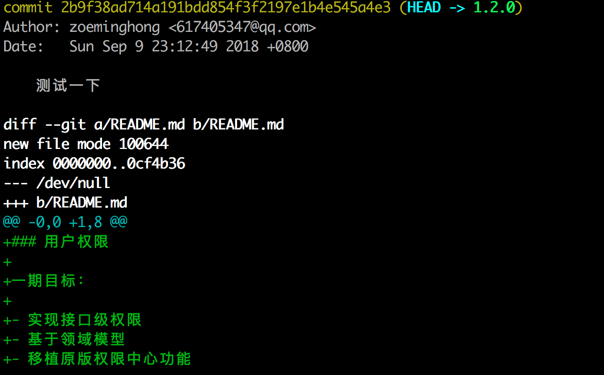

[TOC]

## Quick Start

### 初次运行Git

#### 配置提交作者信息

```shell
git config user.name [昵称或真名]
git config user.email [邮箱地址]
```

或者直接修改`.git`文件夹下的`config`文件

```shell
[user]
    name = [昵称或真名]
    email = [邮箱地址]
```

#### 配置全局提交者信息

```shell
git config --global user.name [昵称或真名]
git config --global user.email [邮箱地址]
```

#### 修改Git编辑器类型

默认是命令行工具的形式，Git也支持使用其他的编辑器方式，下面使用`VS Code`进行讲解：

1. 在`VS Code` 的命令面板中添加`code`命令支持（install code）
2. 从命令行，运行 `git config --global core.editor“code --wait”`
3. 运行 `git config --global -e` 并使用 `VS Code` 作为编辑器来配置 Git
4. 将以下内容添加到您的 Git 配置中，以使用VS Code作为比较差异的工具：

```bash
[diff]
    tool = default-difftool
[difftool "default-difftool"]
    cmd = code --wait --diff $LOCAL $REMOTE
```

可以试试以下命令，体验以下

- `git rebase HEAD~3 -i` do interactive rebase using VS Code
- `git commit` use VS Code for the commit message
- `git add -p` followed by `kbstyle(e)` for interactive add
- `git difftool <commit>^ <commit>` use VS Code as the diff editor for changes

#### 生成SSH秘钥

```shell
# github或者gitlib邮箱账户地址
ssh-keygen -t rsa -C ["邮箱地址"]
```

将电脑上的公钥与远程仓库进行绑定

本地会在上面的步骤中会生成一个id_rsa.pub（默认情况是这个名称），将该文件中的内容copy到远程仓库github或gitlib的settings的SSH配置选项中。

> Tittle名称自由发挥

#### 1、克隆工程

> 将远程的数据复制一份到本地

```shell
#【仓库copy地址】
git clone [git@rep.xx.com:zoeminghong/hello.git]
```

#### 2、本地新建Git工程

> 现在打算将本地的工程，放到Git仓库进行托管了，并且远程Git仓库已经创建了该项目的工程

```shell
#本地初始化工程，会生成一个.git文件
git init

#将本地的工程与远程仓库中的项目进行关联（不用关心项目名不一致的问题）
#此时本地工程与远程仓库已经建立了联系
git remote add origin [git@rep.xx.com:zoeminghong/hello.git]

#将本地所有文件添加到Git中，进行监管
git add .

#将内容提交 【提交注释】
git commit -m "[...]"

#将本地的内容同步到远程仓库中
git push -u origin master
```

### 关键词说明

- HEAD：代表始终指向最新提交记录点
- 显式引用：SHA1就代表显式引用
- 隐式引用：HEAD就代表隐式引用

## 基础命令

Git官方文档地址：https://git-scm.com/docs/

### Add

将文件进行 Git 追踪，信息存储到暂存区

```shell
# 如果 git add .就是当前目录下的所有，包括子目录
git add [路径]
```

### Commit

作为add操作的后续步骤，将数据真正意义上的被存储

```shell
git commit -m ["记录描述"]
```

**--author**：标记作者信息

```shell
git commit -m ["记录描述"] --author=["zoeminghong <617405347@qq.com>"]
```

**-a或者--all**：自动暂存所有未暂存的和未追踪的文件变化

```shell
git commit -a
```

### Mv

重命名文件

```shell
git mv [原文件名] [新文件名]
```

### Log

查看提交信息

```shell
git log
# 查看指定文件的日志信息
git log [文件名]
# 查看提交范围中的提交信息
git log --abbrev-commit master~12..master~10
# 列举提交中所更改的文件以及每个更改的文件中有多少行做了改动
git log --stat master~12..master~10
# 显示一个提交信息
git log -1 [提交名]
# 输出提交引进的补丁或变更
git log -p [提交名]
```


```shell
# 在日志中回溯并找到内容相关联的整个历史记录
git log --follow [文件名]
```

比如：某个文件名称发生了变更，通过该命令就可以追溯原文件名的记录信息

### Show

查看特定提交点的详细信息

```shell
# 显示最近一次提交点的信息
git show
# 显示指定提交点信息
git show 2b9f38ad714a191bdd854f3f2197e1b4e545a4e3
# 显示特定文件的信息
git show orgin/master:[fileName]
# 显示分支下的文件
git show [分支]:[文件名]
```



### Rm

版本库中删除文件

**注：**在删除文件前，最好更新到最新，防止更新意外丢失

```shell
# 将文件从索引和工作目录中都删除
git rm [文件名]
# 由已暂存的文件转为未暂存的文件，但不会删除文件(标记为未追踪)
git rm --cached [文件名]
# 强制删除文件索引和工作目录中的文件
git rm -f [文件]
```

### Reflog

可以查看所有分支的本地仓库的所有操作记录（reset操作和删除的commit记录）

#### git reflog show

显示所有的操作记录信息，是`git reflog`的默认操作。功能等同于`git log -g --abbrev-commit --pretty=oneline`

**范围限定查询**

```shell
git reflog HEAD@{2}
git reflog master@{one.week.ago}
```

### git reflog expire

将制定日期前的所有reflog记录都移除


```shell
# 删除所有的reflog近路
git reflog expire --expire=all --all
```


#### git reflog delete

删除指定的reflog记录，与expire相似

```shell
git reflog delete master@{2}
```

#### git reflog exists

查询指定reflog记录是否存在

```shell
git reflog exists [ref]
```

### Tag

我们在开发的时候，可能存在线上发布了一个版本，需要给这个版本代码打上一个标签，到时候可以方便回退到这个版本

#### git tag

```shell
# 创建tag 【tag名】
git tag v1.0

# 查看存在的tag
git tag

# 将tag更新到远程
git push origin --tags 
```

如果现在线上出现了一个BUG，急需回退到指定Tag节点，进行修复发布，这个时候怎么办呢

```shell
# 查看tag列表
git tag -l
# 根据tag切分支
git branch [new-branch-name] [tag-name]
```

### Branch

分支

```shell
# 创建分支
git branch [1.2.1]
git branch [1.2.1] [分支起始SHA1]
# 查看分支
git branch
# 显示所有分支
git branch -a
# 显示远程追踪分支
git branch -r
# 删除分支
git branch -d [分支名]
```

### Checkout

切换分支

```shell
git checkout [分支名]
# 合并变更到目标分支
git checkout -m [目标分支]
# 创建并切换到新分支
git checkout -b [新分支名]
git checkout -b [1.2.1] [分支起始SHA1]
```

### Diff

比较记录的内容的差异

#### git diff

默认显示暂存区和工作区的差异

```shell
# 显示暂存区和上一个commit的差异【文件名】
$ git diff --cached [hell.txt]

$ git diff [sha1] [sha2]

# 显示工作区与当前分支最新commit之间的差异
$ git diff HEAD

# 显示两次提交之间的差异【分支名】
$ git diff [first-branch]...[second-branch]
```

### Stash

将当前的更新进行暂存，去做另一件事

#### git stash

将工作区中与上个commit提交点之后的修改内容，保存到暂存区，工作区恢复到与上个commit提交点一致。


```shell
# 直接保存到暂存区
git stash
# 自定义存储信息
git stash save '<message info>'
```

#### git stash list

显示保存进度的列表，`git stash` 可以执行多次

#### git stash pop

- `git stash pop` 恢复最新的记录到工作区。
- `git stash pop --index` 如果使用--index选项，则不仅恢复工作树的更改，还恢复索引的更改。当遇到冲突的时候，就会失败
- `git stash pop stash@{1}`恢复指定的记录到工作区。stash_id是通过`git stash list`命令得到的 
  通过`git stash pop`命令恢复记录后，**会删除当前记录。**

#### git stash apply

除了**不删除恢复的记录**之外，其余和`git stash pop` 命令一样。

#### git stash drop

删除一个存储的进度。如果不指定stash_id，则默认删除最新的存储进度。

```shell
git stash drop <stash_id>
```

#### git stash clear

删除所有存储的进度。

### Show-branch

提供提交历史图

```shell
# 限制显示10条记录
git show-branch --more=35 | tail -10
```

### Rev-parse

将各类提交名转换为SHA1值

```shell
git rev-parse [提交名]
git rev-parse master~3
```

### Blame

查看具体文件每行最新变更信息

```shell
# -L 显示行数
git blame -L 35 pom.xml
```

### Bisect

当遇到数据或者提交信息被覆盖的时候，定位最近一次正常提交点的数据。先圈定出错范围，在通过二分法缩小范围。

一般当前HEAD为异常记录，通过

```shell
# 开始
git bisect start
git bisect bad
```

标记“好”

```shell
git bisect good 1.2.0-RC
# 查看已经标记的记录
git bisect log
```

最终确定位置后

```shell
# 由于bisect操作会在一个新分支上进行操作
git branch
# 切换回原先分支
git bisect reset
git branch
```

## 高级使用

### 散列值翻译

```shell
git cat-file -p 2b9f38ad714a191bdd854f3f2197e1b4e545a4e3
```

返回当前散列值对应的数据

### 显示完整的散列

```shell
git rev-parse 3b8512d
```

使用tag也是可以的

```
git rev-parse V1.0
```

### 查看各自文件对应的散列

```shell
git ls-files --stage
```


### 配置文件

在Git中也存在配置文件的优先级层级关系，项目(--file)>全局(--global)>系统(--system)

`.git/config` > `~/.gitconfig` > `/etc/gitconfig`

设值

```shell
git config --global user.name "John"
```

查看整组配置文件

```shell
git config -l
```

移除设值

```shell
git config --global --unset user.name
```

注：低版本的Git，对`--unset`的顺序还有要求。

### 设置别名

使用Git的过程中存在一些命令比较复杂或者说比较长的情况，Git提供了使用别名的方式帮助解决这个问题。

```shell
git config --global alias.show-graph 'log --graph --abbrev-commit --pretty=online'
```

例子中只需命令行执行`git show-graph`，即可实现 `git log --graph --abbrev-commit --pretty=online`

### 文件误删恢复

**文件索引已被删除**

```shell
git rm --cache [data]
# 文件进行追踪操作
git add [data]
```

**文件已被删除**

```shell
git rm [data]
# 恢复当前提交点中data文件
git checkout HEAD -- [data]
```

### `.gitignore`

语法说明

| 符号                    | 说明                                           | 示例     |
| ----------------------- | ---------------------------------------------- | -------- |
| #                       | 用于开头，表示注释                             | `# 说明` |
| 字面文字                | 匹配文字文件，将其排除                         |          |
| 目录名由反斜线（/）标记 | 匹配同名的目录和子目录，但不匹配文件或符号链接 |          |
| *                       | 通配符，模糊匹配                               | *.java   |
| 起始的感叹号！          | 取反作用                                       |          |

### 相对提交名

`^`符号用来选择不同的父提交。给定一个提交C，`C^1`表示第一个父提交，`C^2`表示第二个父提交

`~`符号用于返回父提交之前并选择上一代提交。给定一个提交C，`C~1`表示第一个父提交，`C~`表示第一个祖父提交

## 复杂场景实操

#####A用户把1.2.0分支删了，B本地拥有最新的1.2.0分支

这个时候，可以B将本地的分支代码Push到远程仓库，会自动创建1.2.0分支，同时，其他用户也可以在不修改的情况下拉取最新的1.2.0代码

##### 同事在1.2.0 分支上，对其下某一文件进行修改，突然发现，自己的分支切错了，正确的分支应该是1.1.0 分支，他现在想把1.2.0下面的修改迁移到1.1.0下，而不在1.2.0下做任何提交。

我的解决方案：**使用 `git stash`**

在1.2.0分支上，将已经修改的数据使用 `git stash`，如果存在新建的文件，那么不要对其进行Git追踪，没有被Git追踪的文件在切分支的时候，会自动切过去的。


内容被存到暂存区后，我们切到 `1.1.0` 分支（注：演示中是由于`1.1.0`不存在，所以有 `-b`）


查看一下是否存在暂存信息


从暂存区恢复数据


这样就已经把数据迁移到 `1.1.0` 分支了，我们就可以在该分支下任意玩耍了


我们可以看看 `1.2.0`是否有影响，完全没有影响


**注：**

- 未被Git追踪文件，不用担心，因为Git还管不了你，直接切分支就可以了，这文件想在哪个分支提交，就在哪个分支提交
- 如果暂存区的数据需要删除

```shell
git stash drop [stash_id]
```

```shell
git stash pop [–index] [stash_id]
```

##### 当前`1.2.0`分支上做了修改，但是拉取代码会出现冲突问题。

**如果没有commit，**可以通过stash避免这个问题

```shell
#将当前修改进行暂存起来
git stash

#获取最新的远程仓库代码
git pull

#恢复暂存的内容
git stash pop
```

**如果已经commit**，才发现冲突问题

```shell
# 获取远端库最新信息 【分支名称】
git fetch origin [master]

# 做比较
git diff [本地分支名] origin/[远程分支名]

# 拉取最新代码，同时会让你merge冲突
git pull
```

**方法2**

```shell
# 获取最新代码到tmp分支上 [远程的分支:本地分支]
git fetch origin [master:tmp]

# 当前分支与tmp进行比较
git diff tmp

# 修改冲突部分，进行本地commit操作
git add .

git commit -m "[...]"

# 将tmp中内容合并到当前分支中
git merge tmp

# 删除分支
git branch -d tmp
```

## Tips

- 分支下不存在`track`的内容，则该分支会被`Git`无视，无法通过 `git branch` 查到