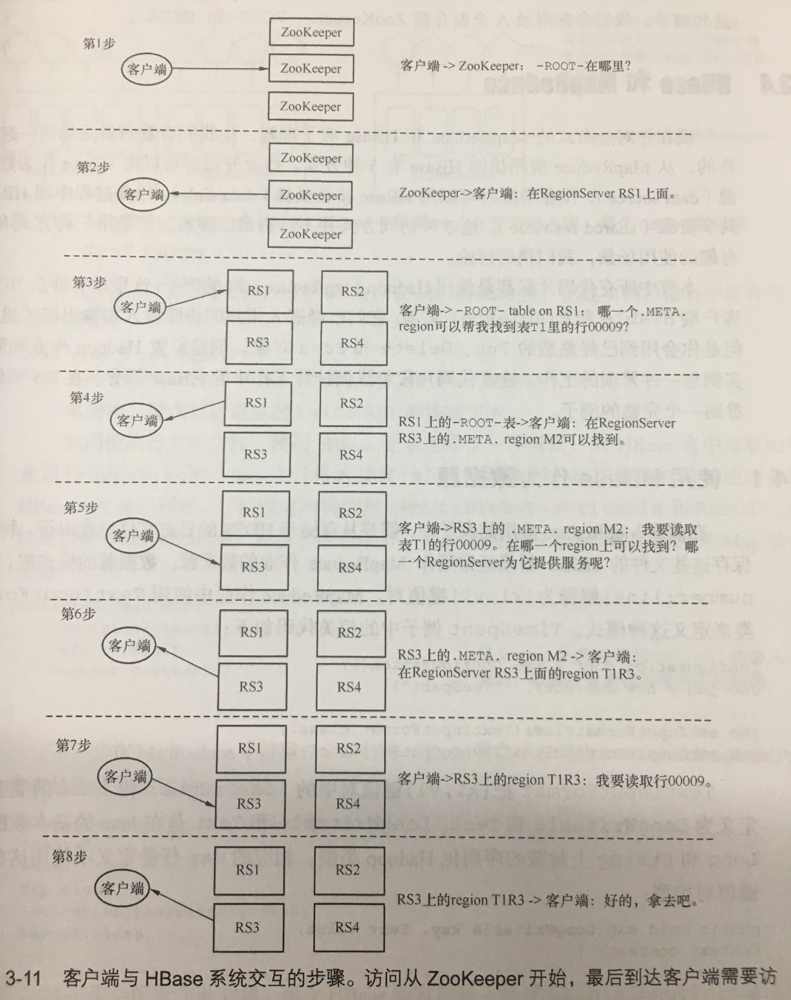

# HBase

[了解HBase](https://mp.weixin.qq.com/s/XNeOceRbpPAUz5_IWLRsyw)

## HBase Master

HMaster服务器控制HBase集群。您可以启动最多9个备用HMaster服务器，这使得10个HMaster服务器成为主服务器。要启动备份HMaster，请使用`local-master-backup.sh`。对于要启动的每个备份主站，添加一个表示该主站的端口偏移量的参数。每个HMaster使用两个端口（默认为16000和16010）。端口偏移量将添加到这些端口，因此使用偏移量2，备份HMaster将使用端口16002和16012.以下命令使用端口16002 / 16012,16003 / 16013和16005/16015启动3个备份服务器。

```shell
./bin/local-master-backup.sh start 2 3 5
```

文件打开数

```
(StoreFiles per ColumnFamily) x (regions per RegionServer)
```

在大多数情况下都可以通过减小StoreFiles的大小来提高性能，从而减少I / O.

HBase使用[wal](https://hbase.apache.org/book.html#wal)来恢复在RS出现故障时尚未刷新到磁盘的memstore数据。这些WAL文件应配置为略小于HDFS块（默认情况下，HDFS块为64Mb，WAL文件为~60Mb）。

## HStore

HStore由一个Memstore及一系列HFile组成。

### MemStore

每个列族都有一个 MemStore，存在于内存之中。

当 RS 处理写请求的时候，数据首先写入到 Memstore，然后当到达一定的阀值的时候，Memstore 中的数据会被刷到 HFile 中。

## HBase 查数据



## 参数指南

**hbase.hregion.memstore.block.multiplier**

**默认值：**2
**说明**：当一个region里的memstore占用内存大小超过hbase.hregion.memstore.flush.size两倍的大小时，block该region的所有请求，进行flush，释放内存。
虽然我们设置了region所占用的memstores总内存大小，比如64M，但想象一下，在最后63.9M的时候，我Put了一个200M的数据，此时memstore的大小会瞬间暴涨到超过预期的hbase.hregion.memstore.flush.size的几倍。这个参数的作用是当memstore的大小增至超过hbase.hregion.memstore.flush.size 2倍时，block所有请求，遏制风险进一步扩大。
**调优**： 这个参数的默认值还是比较靠谱的。如果你预估你的正常应用场景（不包括异常）不会出现突发写或写的量可控，那么保持默认值即可。如果正常情况下，你的写请求量就会经常暴长到正常的几倍，那么你应该调大这个倍数并调整其他参数值，比如hfile.block.cache.size和hbase.regionserver.global.memstore.upperLimit/lowerLimit，以预留更多内存，防止HBase server OOM。

## 锁表恢复

1.获取表的状态
get 'hbase:meta','DMP:DS_TRMALL_ORDER_GOOD','table:state'
2.disable
 put 'hbase:meta','DMP:DS_TRMALL_ORDER_GOOD','table:state',"\b\1"
3.确保表锁了
 is_disabled 'DMP:DS_TRMALL_ORDER_GOOD'
4.备份表
 snapshot 'DMP:DS_TRMALL_ORDER_GOOD', 'cata_tableSnapshot'
5.查看快照，确保有快照内容
 list_snapshots
6.还原表
 restore_snapshot 'cata_tableSnapshot'
7.重启master
8.enbale 表
enable 'DMP:DS_TRMALL_ORDER_GOOD'