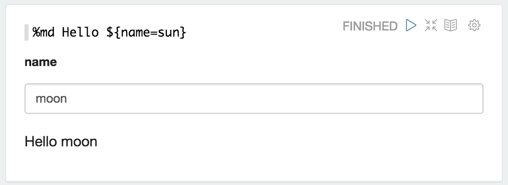

# Zeppelin使用笔记

## 支持语言

| 标识   | 语言     |
| ------ | -------- |
| %sh    | Shell    |
| %md    | markdown |
| %html  | html     |
| %spark | Spark    |

## Form

由一系列的表单组件组成，实现参数的传入。支持 Input、Select、CheckBox等组件。



文档地址：[URL](https://zeppelin.apache.org/docs/0.8.0/usage/dynamic_form/intro.html#text-input-form-1)

### %md

#### Input

```t&#39;x
${formName=defaultValue}
```

#### Select

```
${formName=defaultValue,option1|option2...}
```

```
${formName=defaultValue,option1(DisplayName)|option2(DisplayName)...}
```

#### Checkbox

```
${checkbox:formName=defaultValue1|defaultValue2...,option1|option2...}
```

> 以上是Scope为`paragraph`方式，note方式使用`$$`即可

#### %spark

`scope: paragraph`

#### Input

```
%spark
println("Hello "+z.textbox("name"))
```

**存在默认值**

```
%spark
println("Hello "+z.textbox("name", "sun")) 
```

#### Select

```
%%sparkspark
 printlnprintl ("Hello "+z.select("day", Seq(("1","mon"),
                                    ("2","tue"),
                                    ("3","wed"),
                                    ("4","thurs"),
                                    ("5","fri"),
                                    ("6","sat"),
                                    ("7","sun"))))
```

#### Checkbox

```
%spark
val options = Seq(("apple","Apple"), ("banana","Banana"), ("orange","Orange"))
println("Hello "+z.checkbox("fruit", options).mkString(" and "))
```

**The difference in the method names:**

| Scope paragraph    | Scope note   |
| ------------------ | ------------ |
| input (or textbox) | noteTextbox  |
| select             | noteSelect   |
| checkbox           | noteCheckbox |

## 图表化展示

文档地址：[URL](https://zeppelin.apache.org/docs/0.8.0/usage/display_system/basic.html#html)

## 解释器（Interpreter）

对一些语法的解析、包括依赖的包等管理，可以理解为是一个环境的配置。

文档地址：[URL](https://zeppelin.apache.org/docs/0.8.0/usage/interpreter/overview.html)

## 上下文（Context）

Zeppelin预定义了一个`z`对象。在不同的解释器中都被使用。

### Spark DataFrames

```scala
df = spark.read.csv('/path/to/csv')
z.show(df)
```

### Object Exchange

```scala
// Put object from scala
%spark
val myObject = ...
z.put("objName", myObject)

// Exchanging data frames
myScalaDataFrame = ...
z.put("myScalaDataFrame", myScalaDataFrame)

val myPythonDataFrame = z.get("myPythonDataFrame").asInstanceOf[DataFrame]
```

### Form Creation

```scala
%spark
/* Create text input form */
z.input("formName")

/* Create text input form with default value */
z.input("formName", "defaultValue")

/* Create select form */
z.select("formName", Seq(("option1", "option1DisplayName"),
                         ("option2", "option2DisplayName")))

/* Create select form with default value*/
z.select("formName", "option1", Seq(("option1", "option1DisplayName"),
                                    ("option2", "option2DisplayName")))
```

文档地址：[URL](https://zeppelin.apache.org/docs/0.8.0/usage/other_features/zeppelin_context.html)

## 可以提供

- 生成的图表生成链接，可以复用到Web页面上；[URL](https://zeppelin.apache.org/docs/0.8.0/usage/other_features/publishing_paragraphs.html)
- 支持定时任务，但需要配置开启；[URL](https://zeppelin.apache.org/docs/0.8.0/usage/other_features/cron_scheduler.html)
- 支持API方式对外提供服务；[URL](https://zeppelin.apache.org/docs/0.8.0/usage/rest_api/notebook.html)